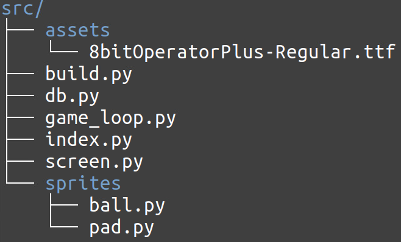

# Projektin rakenne

# Käyttöliittymä

Pelissä käyttöliittymän muodostaa yksi näkymä, jossa peliä pelataan ja näytetään pelaajien tulokset ja kysytään pelaajan nimi tulosten kirjausta varten.
Näkymän piirtäminen tapahtuu luokassa [Gameloop](../src/game_loop.py)

# Sovelluslogiikka

Sovellusloogikka on luokkien [Ball](../src/sprites/ball.py) ja [Pad](../src/sprites/pad.py) vastuulla. Ne muodostavat pelin dynaamiset objektit, joilla pelaaminen tapahtuu. [Gameloop](../src/game_loop.py) luokka vastaa pelin kulusta ja kutsuu luokkien Ball ja Pad metodeita pelin edetessä.

# Tietokanta

Tietokantaan liittyvät funktiot on tiedostossa [db.py](src/db.py).